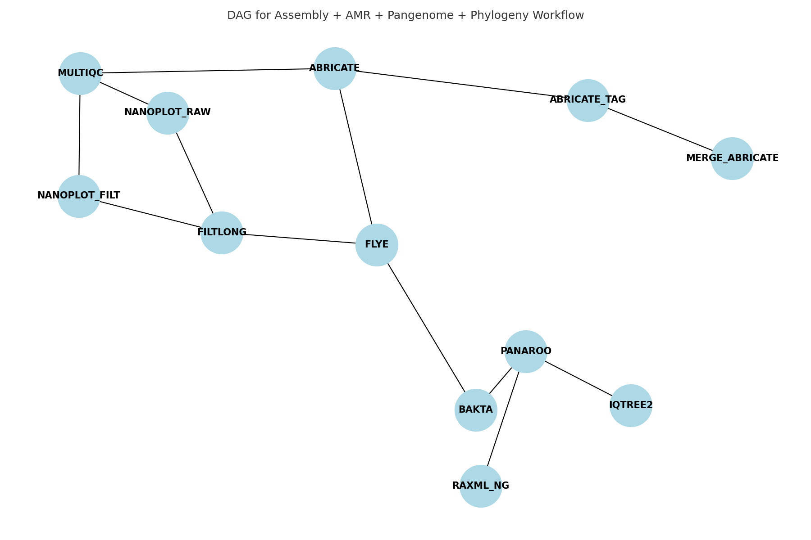

# Nanopore Species Identification and AMR Gene Annotation Pipeline

A modular, reproducible Nextflow DSL2 workflow for identifying bacterial species and AMR genes from Nanopore whole genome sequencing (WGS) data.

## Features
1. Modular DSL2 pipeline with process-specific scripts

2. Species classification via GTDB-Tk and Kraken2

3. AMR gene detection using Abricate (ResFinder only)

4. Summary report with visual output (barplots, CSVs)

5. GitHub CI-tested with dummy data

6. Reproducible via environment.yml

## Workflow DAG

<p align="center">
  
</p>

## Usage

- `nextflow.config` — maps each process label in your pipeline to a dedicated Conda env YAML.
- `envs/*.yml` — one environment per label/tool.

## Notes
- **GTDB-Tk** requires reference data (`GTDBTK_DATA_PATH`), and sometimes specific versions of `pplacer/fasttree`.
- **Kraken2**/**GTDB-Tk**/**AMRFinderPlus** require external databases—configure paths in your Nextflow params.
- If any process uses additional commands not captured by the label, add them to the corresponding env YAML.
- You can switch to a shared env by pointing multiple labels to the same YAML in `nextflow.config`.


## Quickstart
```
# Option 1: Clone and enter
git clone https://github.com/yourusername/nanopore_amr_pipeline.git
cd nanopore_amr_pipeline

# Option 2: Create conda env
mamba env create -f environment.yml
conda activate nanopore_amr

# Run the test dataset
nextflow run main.nf \
  -entry assembly_amr_pangenome \
  --reads '/path/to/*.fastq.gz' \
  -profile conda \
  -with-report -with-timeline -with-trace -with-dag results/report/flow.svg 
```
## Visualise results
```
```
## Expected Output

